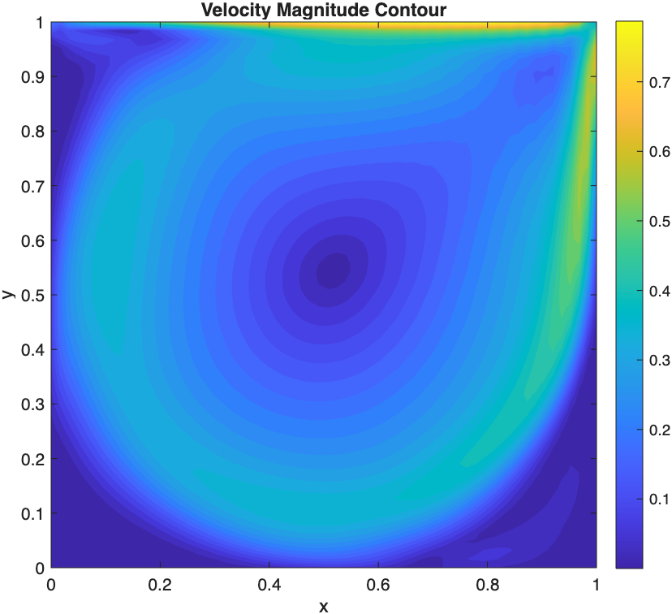
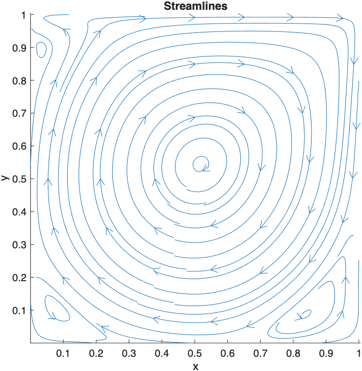
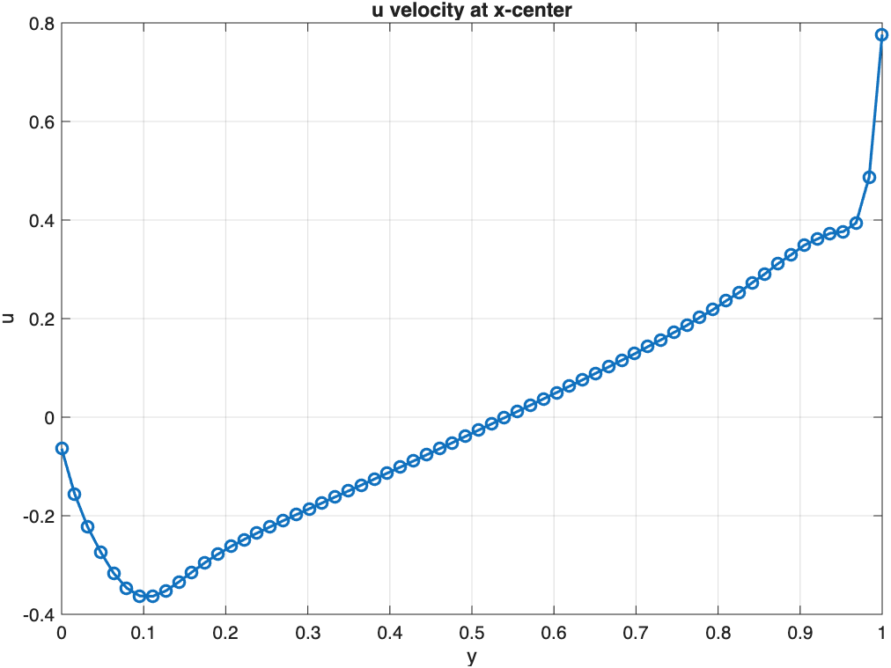
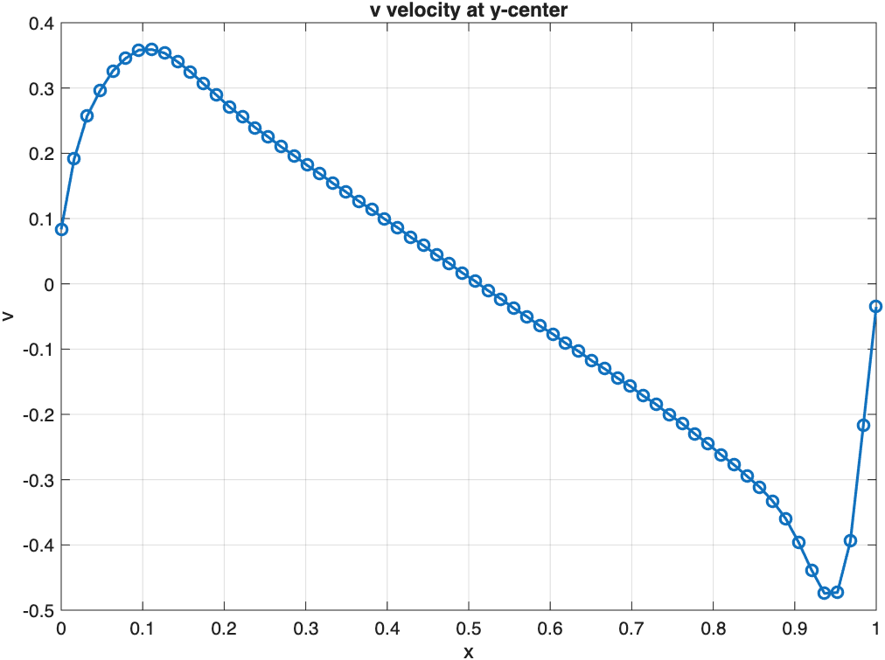

# 2D Lid-Driven Cavity Flow — Semi-Implicit FVM Solver with Approximate Factorization

---

## Table of Contents

1. [Abstract](#1-abstract)
2. [Domain and Boundary Conditions](#2-domain-and-boundary-conditions)
3. [Governing Equations — Incompressible Navier–Stokes (FVM Form)](#3-governing-equations--incompressible-navierstokes-fvm-form)
4. [Time Discretisation — Semi-Implicit Scheme](#4-time-discretisation--semi-implicit-scheme)
5. [Why Approximate Factorization](#5-why-approximate-factorization)
6. [Directional Structure of the Discrete System](#6-directional-structure-of-the-discrete-system)
7. [The Factorization](#7-the-factorization)
8. [The Four-Sweep Algorithm](#8-the-four-sweep-algorithm)
9. [Tridiagonal Coefficients](#9-tridiagonal-coefficients)
10. [Pressure Poisson Equation and Velocity Correction](#10-pressure-poisson-equation-and-velocity-correction)
11. [Boundary Conditions and Ghost Cells](#11-boundary-conditions-and-ghost-cells)
12. [Time Step Constraint](#12-time-step-constraint)
13. [File Structure](#13-file-structure)
14. [Parameters](#14-parameters)
15. [Results](#15-results)

---

## 1. Abstract
 
A semi-implicit finite volume solver is developed for the 2D incompressible lid-driven cavity problem at elevated Reynolds numbers ($Re = 2500$), where fully explicit time-stepping becomes prohibitively restrictive. The solver treats diffusion and linearized convection implicitly in the predictor step, but avoids the cost of assembling and inverting a large coupled sparse system at every step by employing **Approximate Factorization (AF)**. By exploiting the directional separability of the structured finite-volume stencil and the triangular block structure of the $u\text{-}v$ cross-coupling, the implicit solve reduces exactly to four scalar Thomas-algorithm tridiagonal passes per time step — two in the $x$-direction and two in the $y$-direction — with a factorization error of $O(\Delta t^3)$ per step that lies below the truncation floor of the underlying second-order scheme. A pressure Poisson equation with Neumann boundary conditions is solved iteratively via Gauss–Seidel to enforce continuity and recover the corrected velocity field at each time step.
 
---

## 2. Domain and Boundary Conditions

$$x \in [0, 1], \quad y \in [0, 1]$$

A uniform Cartesian grid of $N_x \times N_x$ cells is used with ghost cells on all four sides. All variables ($u$, $v$, $P$) are collocated at cell centres.

**Boundary conditions:**

| Boundary | $u$ | $v$ |
|---|---|---|
| Top (moving lid) | $U_{\text{lid}} = 1$ | $0$ |
| Bottom wall | $0$ | $0$ |
| Left wall | $0$ | $0$ |
| Right wall | $0$ | $0$ |

Ghost cell values enforce these conditions via anti-symmetric reflection for no-slip walls and linear extrapolation for the lid:

```
u_cell_cntr(1,:)   = 2*U_lid - u_cell_cntr(2,:)    ← lid (linear extrap)
u_cell_cntr(:,1)   = -u_cell_cntr(:,2)              ← left wall (anti-sym)
u_cell_cntr(end,:) = -u_cell_cntr(end-1,:)          ← bottom wall
u_cell_cntr(:,end) = -u_cell_cntr(:,end-1)          ← right wall
```

---

## 3. Governing Equations — Incompressible Navier–Stokes (FVM Form)

**x-momentum:**

$$\frac{\partial u}{\partial t} + \frac{\partial(u^2)}{\partial x} + \frac{\partial(uv)}{\partial y} = -\frac{\partial P}{\partial x} + \gamma \nabla^2 u$$

**y-momentum:**

$$\frac{\partial v}{\partial t} + \frac{\partial(uv)}{\partial x} + \frac{\partial(v^2)}{\partial y} = -\frac{\partial P}{\partial y} + \gamma \nabla^2 v$$

**Continuity:**

$$\frac{\partial u}{\partial x} + \frac{\partial v}{\partial y} = 0$$

where $\gamma = 1/Re$. In finite volume form, all flux terms are converted to face-sum integrals over each control volume via the divergence theorem.

---

## 4. Time Discretisation — Semi-Implicit Scheme

The momentum equations are written in **delta form** for the velocity increments $\Delta u = u^{n+1} - u^n$, $\Delta v = v^{n+1} - v^n$:

$$\frac{\Delta u}{\Delta t} + (A_x + A_y)\Delta u = \text{RHS}_u$$

$$\frac{\Delta v}{\Delta t} + (A_x + A_y)\Delta v = \text{RHS}_v$$

where $A_x$ collects all discretization terms shifting the grid index in the $x$-direction (east/west faces), and $A_y$ collects all terms shifting in the $y$-direction (north/south faces). The RHS contains the explicit convection, diffusion, and pressure gradient evaluated at the current time level $n$:

$$\text{RHS}_u = \Delta t \cdot \frac{-C(u)^n - \nabla P^n + \gamma \nabla^2 u^n}{\Delta x \Delta y}$$

$$\text{RHS}_v = \Delta t \cdot \frac{-C(v)^n - \nabla P^n + \gamma \nabla^2 v^n}{\Delta x \Delta y}$$

The implicit operator $(I/\Delta t + A_x + A_y)$ is what must be inverted at every time step — this is the expensive step that AF replaces.

**Implemented in:** `RHS_u_mom.m`, `RHS_v_mom.m`

---

## 5. Why Approximate Factorization

Solving the delta-form system directly would require assembling and inverting a single $2N \times 2N$ coupled sparse block system at every time step, with coefficients that change each step as they depend on the current velocity field. This is expensive both in assembly ($O(N^2)$ fill) and solve ($O(N^{1.5\text{–}2})$ for 2D sparse systems).

Approximate Factorization avoids this by exploiting the **directional separability** of the structured FV stencil:

$$\left(\frac{I}{\Delta t} + A_x + A_y\right)\mathbf{w} = \mathbf{R}$$

is approximated by the **factored product**:

$$\left(\frac{I}{\Delta t} + A_x\right)\left(\frac{I}{\Delta t} + A_y\right)\mathbf{w} = \mathbf{R}$$

Expanding the product introduces an extra term $A_x A_y \mathbf{w}$, which couples diagonal/corner neighbours $(l\pm1, m\pm1)$. Since $A_x, A_y = O(\Delta t)$ and $\mathbf{w} = O(\Delta t)$, this term is $O(\Delta t^3)$ per step — **below the truncation floor** of the underlying second-order scheme — so dropping it does not reduce the formal accuracy of the method.

---

## 6. Directional Structure of the Discrete System

The key structural property that makes AF work here is **triangularity within each directional operator**:

- Within $A_x$: the $u$-row of every neighbour block has **no dependence on $\Delta v$**. The only $u\text{-}v$ cross-coupling comes from $\partial(uv)/\partial y$, which lives entirely in $A_y$.
- Within $A_y$: the $v$-row has **no dependence on $\Delta u$**. The cross-coupling $\partial(uv)/\partial x$ lives entirely in $A_x$.

Consequently:
- Every $2\times2$ block inside $A_x$ is **lower-triangular** ($u$ self-contained, $v$ depends on both)
- Every $2\times2$ block inside $A_y$ is **upper-triangular** ($v$ self-contained, $u$ depends on both)

This triangularity means each directional sweep decomposes into **two independent scalar tridiagonal systems** — no block tridiagonal solve is ever needed.

---

## 7. The Factorization

Writing $L_x = -\Delta t \cdot A_x$ and $L_y = -\Delta t \cdot A_y$, the exact system is:

$$(I - L_x - L_y)\mathbf{w} = \tilde{\mathbf{R}}$$

AF replaces this with the product form, solved via an intermediate field $\mathbf{w}^{\ast}$:

$$\text{Sweep 1: } (I - L_x)\mathbf{w}^{\ast} = \tilde{\mathbf{R}}$$

$$\text{Sweep 2: } (I - L_y)\mathbf{w} = \mathbf{w}^{\ast}$$

The error introduced is:

$$(I - L_x)(I - L_y) - (I - L_x - L_y) = L_x L_y = O(\Delta t^3)$$

which is formally negligible relative to the $O(\Delta t^2)$ truncation error already accepted by the time scheme.

---

## 8. The Four-Sweep Algorithm

The factorization and triangularity together reduce the entire implicit solve to **four scalar Thomas-algorithm passes** per time step:

```
Sweep 1 — x-direction (one tridiagonal per row):

  Step 1a:  Solve for Δu*_bar
            (u-row of L_x is self-contained → independent scalar tridiagonal in x)
            Coefficients: ap, aw, ae  from coeff_sides_u.m
            RHS: RHS_u_mom.m

  Step 1b:  Solve for Δv*_bar
            (v-row of L_x depends on Δu*_bar, now known → second scalar tridiagonal in x)
            Coefficients: adash_p, adash_w, adash_e  from coeff_sides_v.m
            RHS: RHS_v_mom.m  (includes Δu*_bar coupling terms hp, hw, he)

Sweep 2 — y-direction (one tridiagonal per column):

  Step 2a:  Solve for Δv*
            (v-row of L_y is self-contained → independent scalar tridiagonal in y)
            Coefficients: bdash_p, bdash_n, bdash_s  from coeff_tb_v.m
            RHS: Δv*_bar

  Step 2b:  Solve for Δu*
            (u-row of L_y depends on Δv*, now known → second scalar tridiagonal in y)
            Coefficients: bp, bs, bn  from coeff_tb_u.m
            RHS: RHS_final.m  (Δu*_bar minus Δv* coupling terms gp, gs, gn)
```

**Result:** $\Delta u^{\ast} = \Delta u$ predicted increment, $\Delta v^{\ast} = \Delta v$ predicted increment.

At no point is a $2\times2$-block tridiagonal, nor the full $2N \times 2N$ matrix, assembled or solved.

---

## 9. Tridiagonal Coefficients

All four tridiagonal systems share the same structure: a diagonal entry $(1 + \alpha_p)$ with off-diagonal entries $\alpha_{\text{west/east}}$ or $\alpha_{\text{north/south}}$ from the implicit discretization of diffusion and linearized convection.

### x-direction coefficients for $u$ (`coeff_sides_u.m`)

$$a_p = \Delta t \left(\frac{2\gamma}{\Delta x^2} + \frac{u_{i,j+1} - u_{i,j-1}}{4\Delta x} + \frac{u_{f,e} - u_{f,w}}{2\Delta x}\right)$$

$$a_w = \Delta t \left(-\frac{\gamma}{\Delta x^2} - \frac{u_{i,j}}{4\Delta x} - \frac{u_{i,j-1}}{4\Delta x} - \frac{u_{f,w}}{2\Delta x}\right)$$

$$a_e = \Delta t \left(-\frac{\gamma}{\Delta x^2} + \frac{u_{i,j}}{4\Delta x} + \frac{u_{i,j+1}}{4\Delta x} + \frac{u_{f,e}}{2\Delta x}\right)$$

where $u_{f,e}$, $u_{f,w}$ are face-interpolated normal velocities from `u_cell_face_sides_intp`.

### x-direction coefficients for $v$ (`coeff_sides_v.m`)

$$a'_p = \Delta t \left(\frac{2\gamma}{\Delta x^2} + \frac{u_{f,e} - u_{f,w}}{2\Delta x}\right)$$

$$a'_w = \Delta t \left(-\frac{\gamma}{\Delta x^2} - \frac{u_{f,w}}{2\Delta x}\right), \quad a'_e = \Delta t \left(-\frac{\gamma}{\Delta x^2} + \frac{u_{f,e}}{2\Delta x}\right)$$

Cross-coupling coefficients $h_p$, $h_w$, $h_e$ carry the $\Delta u^{\ast}_{\text{bar}}$ contribution from the $v$-equation RHS.

### y-direction coefficients for $v$ (`coeff_tb_v.m`)

$$b'_p = \Delta t \left(\frac{2\gamma}{\Delta y^2} + \frac{v_{i-1,j} - v_{i+1,j}}{4\Delta y} + \frac{v_{f,n} - v_{f,s}}{2\Delta y}\right)$$

$$b'_n = \Delta t \left(-\frac{\gamma}{\Delta y^2} + \frac{v_{i,j}}{4\Delta y} + \frac{v_{i-1,j}}{4\Delta y} + \frac{v_{f,n}}{2\Delta y}\right)$$

$$b'_s = \Delta t \left(-\frac{\gamma}{\Delta y^2} - \frac{v_{i,j}}{4\Delta y} - \frac{v_{i+1,j}}{4\Delta y} - \frac{v_{f,s}}{2\Delta y}\right)$$

### y-direction coefficients for $u$ (`coeff_tb_u.m`)

$$b_p = \Delta t \left(\frac{2\gamma}{\Delta y^2} + \frac{v_{f,n} - v_{f,s}}{2\Delta y}\right)$$

$$b_n = \Delta t \left(-\frac{\gamma}{\Delta y^2} + \frac{v_{f,n}}{2\Delta y}\right), \quad b_s = \Delta t \left(-\frac{\gamma}{\Delta y^2} - \frac{v_{f,s}}{2\Delta y}\right)$$

Cross-coupling coefficients $g_p$, $g_s$, $g_n$ carry the $\Delta v^{\ast}$ contribution from the $u$-equation RHS (`RHS_final.m`).

---

## 10. Pressure Poisson Equation and Velocity Correction

After the four AF sweeps yield the predicted increments $\Delta u^{\ast}$, $\Delta v^{\ast}$, the predicted velocity field is:

$$u^{\ast} = u^n + \Delta u^{\ast}, \quad v^{\ast} = v^n + \Delta v^{\ast}$$

This predicted field does not satisfy continuity. A pressure correction $\delta P$ is found by solving the **pressure Poisson equation** whose source term is the divergence of the predicted face velocities:

$$\text{RHS}_P(i,j) = \left(u^{\ast}_{f,e} - u^{\ast}_{f,w}\right)\Delta y + \left(v^{\ast}_{f,n} - v^{\ast}_{f,s}\right)\Delta x$$

The Poisson equation is solved iteratively using **Gauss–Seidel** with Neumann BCs ($\partial P / \partial n = 0$ on all walls) and a pressure gauge fix at one corner node.

**Face velocity correction:**

$$u_{f,e}^{n+1} = u^{\ast}_{f,e} - \frac{\delta P_{i,j+1} - \delta P_{i,j}}{\Delta x}$$

$$v_{f,n}^{n+1} = v^{\ast}_{f,n} - \frac{\delta P_{i,j} - \delta P_{i+1,j}}{\Delta y}$$

**Cell-centre velocity correction** (2nd-order central difference):

$$u^{n+1}_{i,j} = u^{\ast}_{i,j} - \frac{\delta P_{i,j+1} - \delta P_{i,j-1}}{2\Delta x}$$

$$v^{n+1}_{i,j} = v^{\ast}_{i,j} - \frac{\delta P_{i-1,j} - \delta P_{i+1,j}}{2\Delta y}$$

**Pressure update:**

$$P^{n+1} = P^n + \frac{\delta P}{\Delta t}$$

**Implemented in:** `pressure_poisson_GS.m`, `delt_delP_faces.m`

---

## 11. Boundary Conditions and Ghost Cells

Three distinct ghost-cell treatments arise in this solver, each appropriate to the quantity being held:

| Quantity type | Ghost cell relation | Reason |
|---|---|---|
| Full velocity ($u^{\ast}$, $u^{n+1}$) | $u_{\text{ghost}} = 2u_{\text{wall}} - u_{\text{interior}}$ | Physical Dirichlet reflection — true quantity, wall value fixed |
| True delta ($\Delta u$, $\Delta v$) | $\Delta u_{\text{ghost}} = -\Delta u_{\text{interior}}$ | Wall value time-invariant → increment at wall is zero → anti-symmetric |
| AF intermediate ($\Delta \bar{u}^{\ast}$, $\Delta \bar{v}^{\ast}$) | Same delta-type anti-symmetric | $O(\Delta t^2)$ approximation — consistent with factorization error already accepted |

The ghost-cell value is **folded directly into the diagonal entry** of the first/last interior row of each tridiagonal system, eliminating the need to carry ghost cells as explicit unknowns.

**Implemented in:** `bound_cond.m`, with delta-type ghost cells applied at the end of each of the four tridiagonal functions.

---

## 12. Time Step Constraint

$$\Delta t_{\text{adv}} = \frac{1}{|u|_{\max}/\Delta x + |v|_{\max}/\Delta y}, \quad \Delta t_{\text{diff}} = \frac{1}{2\gamma(1/\Delta x^2 + 1/\Delta y^2)}$$

$$\Delta t = \text{CFL} \cdot \min(\Delta t_{\text{adv}},\ \Delta t_{\text{diff}}), \quad \text{CFL} = 0.5$$

> Even though the implicit predictor step removes the diffusive stability constraint in principle, the CFL condition is retained here to control the convective time step and maintain accuracy of the explicit RHS evaluation.

**Implemented in:** `dt_lid_driven_cavity.m`

---

## 13. File Structure

| File | Role | Called by |
|---|---|---|
| `main_code_FVM.m` | Driver: grid, IC, time loop, AF sweeps, pressure correction, plots | — |
| `bound_cond.m` | Ghost cell BCs for all cell-centre and face arrays | `main_code_FVM.m` + AF functions |
| `interpl_faces.m` | Linear interpolation of cell-centre values to face centres | `main_code_FVM.m` |
| `delustarbar_fnc_tridiag.m` | Sweep 1a: x-tridiagonal for $\Delta u^{\ast}_{\text{bar}}$ | `main_code_FVM.m` |
| `delvstarbar_fnc_tridiag.m` | Sweep 1b: x-tridiagonal for $\Delta v^{\ast}_{\text{bar}}$ (uses $\Delta u^{\ast}_{\text{bar}}$) | `main_code_FVM.m` |
| `delvstar_fnc_tridiag.m` | Sweep 2a: y-tridiagonal for $\Delta v^{\ast}$ | `main_code_FVM.m` |
| `delustar_fnc_tridiag.m` | Sweep 2b: y-tridiagonal for $\Delta u^{\ast}$ (uses $\Delta v^{\ast}$) | `main_code_FVM.m` |
| `coeff_sides_u.m` | x-direction coefficients $a_p$, $a_w$, $a_e$ for $u$ tridiagonal | `delustarbar_fnc_tridiag.m` |
| `coeff_sides_v.m` | x-direction coefficients $a'_p$, $a'_w$, $a'_e$, $h_p$, $h_w$, $h_e$ for $v$ tridiagonal | `delvstarbar_fnc_tridiag.m` |
| `coeff_tb_v.m` | y-direction coefficients $b'_p$, $b'_n$, $b'_s$ for $v$ tridiagonal | `delvstar_fnc_tridiag.m` |
| `coeff_tb_u.m` | y-direction coefficients $b_p$, $b_s$, $b_n$, $g_p$, $g_s$, $g_n$ for $u$ tridiagonal | `delustar_fnc_tridiag.m` |
| `RHS_u_mom.m` | Explicit RHS: convection + pressure + diffusion for $u$ | `delustarbar_fnc_tridiag.m` |
| `RHS_v_mom.m` | Explicit RHS: convection + pressure + diffusion for $v$ (+ $\Delta u^{\ast}_{\text{bar}}$ coupling) | `delvstarbar_fnc_tridiag.m` |
| `RHS_final.m` | Final RHS for $\Delta u^{\ast}$ sweep: $\Delta u^{\ast}_{\text{bar}}$ minus $\Delta v^{\ast}$ coupling | `delustar_fnc_tridiag.m` |
| `pressure_poisson_GS.m` | Gauss–Seidel solve for pressure correction $\delta P$ | `main_code_FVM.m` |
| `delt_delP_faces.m` | Face-level pressure gradients from cell-centre $\delta P$ | `main_code_FVM.m` |
| `dt_lid_driven_cavity.m` | Adaptive CFL + diffusive time step | `main_code_FVM.m` |

### Call Graph

```
main_code_FVM.m
│
├── bound_cond.m              ← IC boundary conditions
├── interpl_faces.m           ← initial face interpolation
│
└── Time loop:
    ├── dt_lid_driven_cavity.m
    │
    ├── AF PREDICTOR (4 sweeps):
    │   ├── delustarbar_fnc_tridiag.m    ← Sweep 1a: Δu*_bar (x-tridiag)
    │   │   ├── RHS_u_mom.m
    │   │   └── coeff_sides_u.m
    │   │
    │   ├── delvstarbar_fnc_tridiag.m    ← Sweep 1b: Δv*_bar (x-tridiag)
    │   │   ├── RHS_v_mom.m
    │   │   └── coeff_sides_v.m
    │   │
    │   ├── delvstar_fnc_tridiag.m       ← Sweep 2a: Δv* (y-tridiag)
    │   │   └── coeff_tb_v.m
    │   │
    │   └── delustar_fnc_tridiag.m       ← Sweep 2b: Δu* (y-tridiag)
    │       ├── coeff_tb_u.m
    │       └── RHS_final.m
    │
    ├── bound_cond.m + interpl_faces.m   ← apply BCs to predicted field
    │
    ├── PRESSURE CORRECTION:
    │   ├── pressure_poisson_GS.m        ← solve for δP
    │   └── delt_delP_faces.m            ← face-level ∇(δP)
    │
    └── VELOCITY CORRECTION + BC:
        └── bound_cond.m
```

---

## 14. Parameters

| Parameter | Symbol | Value | Description |
|---|---|---|---|
| Reynolds number | $Re$ | `2500` | Sets $\gamma = 1/Re$ |
| Grid points | $N_x$ | `64` | Uniform cells in each direction |
| Domain | — | $[0,1]^2$ | Unit square cavity |
| Lid velocity | $U_{\text{lid}}$ | `1` | Top wall speed |
| CFL number | CFL | `0.5` | Time step safety factor |
| Simulation time | $T$ | `50` | Total run time |
| GS tolerance | — | `1e-8` | Pressure Poisson convergence |
| GS max iterations | — | `10000` | Maximum Gauss–Seidel iterations |

---

## 15. Results

All results are for $Re = 2500$, $N_x = 64$.

### Velocity Contour and Streamlines

| Velocity Magnitude | Streamlines |
|:---:|:---:|
|  |  |

### Centreline Velocity Profiles

| u at x-centre | v at y-centre |
|:---:|:---:|
|  |  |

> The solver captures the primary recirculation vortex and developing secondary eddies characteristic of $Re = 2500$. The AF method achieves this at a fraction of the cost of a direct coupled solve - reassembled $2N \times 2N$ sparse system solve at every time step.

---

### Benchmark

Check out the benchmark data for Re=2500. You can see the exact numerical data that we have produced with our method.

> *https://www.acenumerics.com/the-benchmarks.html*

---

*Solver: 2D Lid-Driven Cavity — Collocated FVM, Semi-Implicit predictor via Approximate Factorization (4 scalar Thomas-algorithm sweeps), Gauss–Seidel Pressure Poisson correction. Implemented in MATLAB.*
